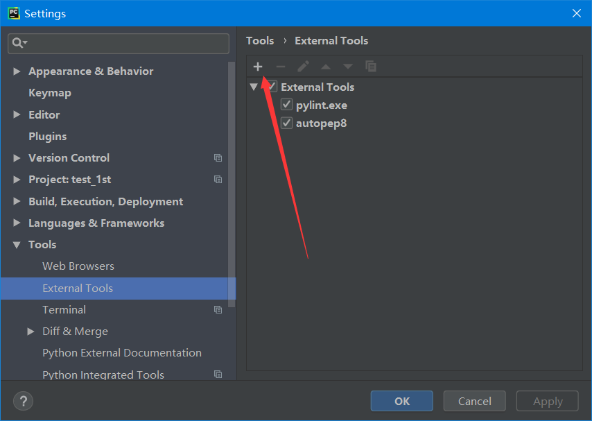

# Python的语法规则


``` python
# 注释：第一个python程序

import time  # 导入一个时间模块

print(time.time())  # 在屏幕上打印时间戳

if 10 - 9 > 0:
    # 缩进四个空格
    print('10大于9.')

```

如上，是一个简单的Python程序，

* `#`  注释行
* `import`  关键字用来导入模块
* Python 中四个空格缩进代表此代码块属于上一句（缩进少四个空格）闭包内。


## Python编程语言需要遵循PEP8规范，但是初学者往往记不住这个规范

Pycharm可以安装以下两个工具来检查和辅助排版：

* `pylint`是代码检查工具
* `autopep8`是一款将python代码自动排版为PEP8风格的工具


### pylint

安装：

```bash
pip install pylint
```

PyCharm 设置:

> 文件（file）-> 设置（settings）-> 外部工具(external tools)



设置如下：

| key               | value                                                        | 描述                                          |
| ----------------- | ------------------------------------------------------------ | --------------------------------------------- |
| program           | C:\Users\Administrator\AppData\Local\Programs\Python\Python37-32\Scripts\pylint.exe **这是我的，你可以根据自己的。** | python安装路径下的Scripts路径，pylint.exe路径 |
| Arguments         | `--reports=n --disable=C0103 $FilePath$`                     | 最后必须以`$FilePath$`结尾                    |
| working directory | `$FileDir$`                                                  | 必须是这个                                    |
| output filters    | `$FILE_PATH$:$LINE$:`                                        |                                               |


配置完毕，选择一个Python程序，右键点击，快捷菜单中会有“Extensions Tools -> Pylint”，点击运行即可。输出结果在执行程序结果的窗口（IDE下半部分）。

如果看到返回值为0，说明程序没问题了。

### autopep8

autopep8是一款将python代码自动排版为PEP8风格的工具

安装：

``` bash
pip install autopep8
```

配置：

同样在`external tools`中：

| key               | value                                                        | 描述                                            |
| ----------------- | ------------------------------------------------------------ | ----------------------------------------------- |
| program           | C:\Users\Administrator\AppData\Local\Programs\Python\Python37-32\Scripts\autopep8.exe **这是我的，你可以根据自己的。** | python安装路径下的Scripts路径，autopep8.exe路径 |
| Arguments         | `--in-place --aggressive --aggressive $FilePath$`            | 最后必须以`$FilePath$`结尾                      |
| working directory | `$ProjectFileDir$`                                           | 必须是这个                                      |
| output filters    | `$FILE_PATH$:$LINE$:$COLUMN$:.*`                             |                                                 |


将鼠标放在该文件的编辑器中→右键→External Tools→点击Autopep8。这样你的代码就符合pep8的风格了。