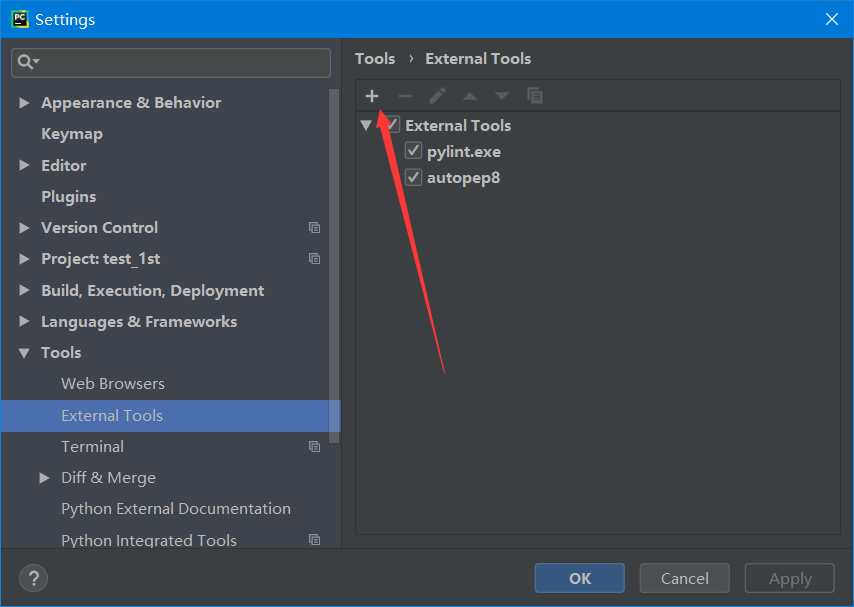
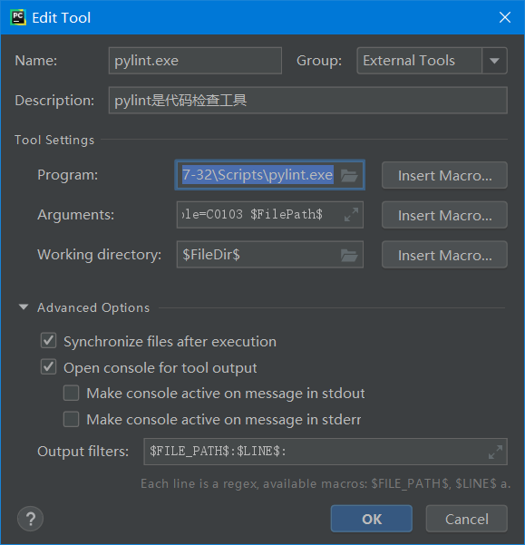
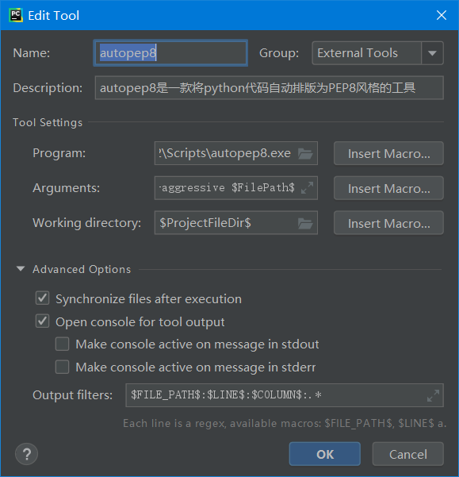

# Python的语法规则

默认情况下，Python 3 源码文件以 **UTF-8** 编码。

## 标识符

- 第一个字符必须是字母表中字母或下划线 **_** 。
- 标识符的其他的部分由字母、数字和下划线组成。
- 标识符对大小写敏感。

## python保留字

保留字即关键字，我们不能把它们用作任何标识符名称。Python 的标准库提供了一个 keyword 模块，可以输出当前版本的所有关键字：

``` python
import keyword

print(keyword.kwlist)
```

输出：

``` bash
E:\workspace\Python\Python-study\code\test_1st\venv\Scripts\python.exe E:/workspace/Python/Python-study/code/test_1st/keywords.py
['False', 'None', 'True', 'and', 'as', 'assert', 'async', 'await', 'break', 'class', 'continue', 'def', 'del', 'elif', 'else', 'except', 'finally', 'for', 'from', 'global', 'if', 'import', 'in', 'is', 'lambda', 'nonlocal', 'not', 'or', 'pass', 'raise', 'return', 'try', 'while', 'with', 'yield']
```

## 注释

Python中单行注释以 **#** 开头,多行注释可以用多个 **#** 号，还有 **'''** 和 **"""**：

``` python
# 第一个注释
# 第二个注释
 
'''
第三注释
第四注释
'''
 
"""
第五注释
第六注释
"""
```

## 行与缩进

python最具特色的就是使用缩进来表示代码块，不需要使用大括号 **{}** 。

缩进的空格数是可变的，但是同一个代码块的语句必须包含相同的缩进空格数。

``` python
# 注释：第一个python程序

import time  # 导入一个时间模块

print(time.time())  # 在屏幕上打印时间戳

if 10 - 9 > 0:
    # 缩进四个空格
    print('10大于9.')

```

如上，是一个简单的Python程序，

* `#`  注释行
* `import`  关键字用来导入模块
* Python 中四个空格缩进代表此代码块属于上一句（缩进少四个空格）闭包内。

## 多行语句

Python 通常是一行写完一条语句，但如果语句很长，我们可以使用反斜杠(\)来实现多行语句，例如：

```python
total = item_one + \
        item_two + \
        item_three
```

在 [], {}, 或 () 中的多行语句，不需要使用反斜杠(\)，例如：

```python
total = ['item_one', 'item_two', 'item_three',
        'item_four', 'item_five']
```


## Python编程语言需要遵循PEP8规范，但是初学者往往记不住这个规范

Pycharm可以安装以下两个工具来检查和辅助排版：

* `pylint`是代码检查工具
* `autopep8`是一款将python代码自动排版为PEP8风格的工具


### pylint

安装：

```bash
pip install pylint
```

PyCharm 设置:

> 文件（file）-> 设置（settings）-> 外部工具(external tools)



设置如下：

| key               | value                                                        | 描述                                          |
| ----------------- | ------------------------------------------------------------ | --------------------------------------------- |
| program           | C:\Users\Administrator\AppData\Local\Programs\Python\Python37-32\Scripts\pylint.exe **这是我的，你可以根据自己的。** | python安装路径下的Scripts路径，pylint.exe路径 |
| Arguments         | `--reports=n --disable=C0103 $FilePath$`                     | 最后必须以`$FilePath$`结尾                    |
| working directory | `$FileDir$`                                                  | 必须是这个                                    |
| output filters    | `$FILE_PATH$:$LINE$:`                                        |                                               |



配置完毕，选择一个Python程序，右键点击，快捷菜单中会有“Extensions Tools -> Pylint”，点击运行即可。输出结果在执行程序结果的窗口（IDE下半部分）。

如果看到返回值为0，说明程序没问题了。

### autopep8

autopep8是一款将python代码自动排版为PEP8风格的工具

安装：

``` bash
pip install autopep8
```

配置：

同样在`external tools`中：

| key               | value                                                        | 描述                                            |
| ----------------- | ------------------------------------------------------------ | ----------------------------------------------- |
| program           | C:\Users\Administrator\AppData\Local\Programs\Python\Python37-32\Scripts\autopep8.exe **这是我的，你可以根据自己的。** | python安装路径下的Scripts路径，autopep8.exe路径 |
| Arguments         | `--in-place --aggressive --aggressive $FilePath$`            | 最后必须以`$FilePath$`结尾                      |
| working directory | `$ProjectFileDir$`                                           | 必须是这个                                      |
| output filters    | `$FILE_PATH$:$LINE$:$COLUMN$:.*`                             |                                                 |



将鼠标放在该文件的编辑器中→右键→External Tools→点击Autopep8。这样你的代码就符合pep8的风格了。